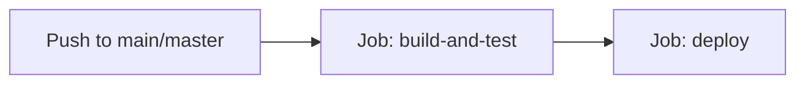

# HandyLand — Project State & Verified Architecture

> **Audience**: AI Coding Agents & System Engineers  
> **Source Verification Date**: August 26, 2026  
> **Ground Truth Rule**: Every statement in this document is cited with exact source files, line ranges, commit hashes, or test execution metrics. No unverified or promotional claims are permitted.

---

## 1. Verified Architecture

### 1.1 Technology Stack & Providers
- **Runtime Environment**: Node.js (v20.x / v22.x matrix in CI) `[.github/workflows/main.yml:15]`
- **HTTP Server Framework**: Express `5.2.1` `[backend/package.json:33]`, initialized at `[backend/server.js:34]`
- **Real-Time Communication**: Socket.IO `4.8.3` `[backend/package.json:47]`, managed in `[backend/utils/socket.js:1-195]`
- **Background Task Scheduling**: `node-cron` `4.2.1` `[backend/package.json:41]`, managed in `[backend/services/cronService.js:1-146]`
- **Database & Auth Provider**: Supabase (`@supabase/supabase-js` `2.105.4`, PostgreSQL instance) `[backend/package.json:26]`, configured in `[backend/config/supabase.js:1-57]`
- **Payment Processing Engines**:
  - Stripe SDK `20.3.1` `[backend/package.json:50]`, initialized in `[backend/controllers/paymentController.js:7]`
  - PayPal REST API v2 via native Node.js `fetch` `[backend/controllers/paymentController.js:139-182]`
- **Media Asset Storage**: Cloudinary `2.10.0` `[backend/utils/cloudinaryUpload.js:1-45]` with Supabase Storage fallback `[backend/config/supabase.js:60-116]`
- **Transactional Email Service**: Nodemailer `8.0.1` configured over SMTP `[backend/utils/emailService.js:8-37]`
- **Frontend Applications**:
  - Customer Portal: React 18 + TypeScript + Vite + TailwindCSS `[front-end/package.json:1-45]`
  - Administrative Single Page Application: React + Vite + TypeScript `[backend/admin/package.json:1-35]`

---

### 1.2 Verified Directory Structure
```
handyland/
├── .github/
│   └── workflows/
│       └── main.yml               # CI/CD Pipeline definition [ .github/workflows/main.yml:1-58 ]
├── backend/
│   ├── admin/                     # Admin Single Page Application (Vite + React)
│   ├── config/                    # Security, Swagger, Supabase, and Environment configs
│   ├── controllers/               # 35 Express controller modules
│   ├── coverage/                  # Jest Istanbul coverage outputs
│   ├── middleware/                # Auth, CSRF, rate limiter, cache, validation, upload
│   ├── routes/                    # 37 Route definition files mounted via routes/index.js
│   ├── scripts/                   # Migration, scraping, seed, and maintenance scripts
│   ├── services/                  # Background cron, eBay pricing, phone verification
│   ├── tests/                     # 6 Jest test suites + test setup and diagnostics
│   ├── utils/                     # Logger, socket manager, email service, encryption
│   ├── package.json               # Backend dependencies & npm scripts [ backend/package.json:1-71 ]
│   └── server.js                  # Main Express entry point & HTTP server [ backend/server.js:1-188 ]
├── front-end/                     # Customer Frontend application
├── supabase/                      # Database migrations & RLS SQL definitions
├── AGENT_INSTRUCTIONS.md          # Strict operational rules for AI coding agents
├── API_DOCUMENTATION.md           # Complete verified endpoint catalog
└── PROJECT_STATE.md               # This document
```

---

### 1.3 Verified Active Dependencies (Imported in Codebase)
Source: Verified via static import analysis against `backend/package.json:22-57` on August 26, 2026.

| Dependency Package | Declared Version | Primary Usage Location in Codebase |
| :--- | :--- | :--- |
| `@sentry/node` | `^10.46.0` | `[backend/server.js:8-15]` (Application error logging & tracing) |
| `@supabase/supabase-js` | `^2.105.4` | `[backend/config/supabase.js:7-57]` (Database CRUD & Auth sessions) |
| `axios` | `^1.13.4` | `[backend/scripts/scrapeWirkaufens.js:6]` (Data scraping & E2E scripts) |
| `cloudinary` | `^2.10.0` | `[backend/utils/cloudinaryUpload.js:5]` (Image CDN upload & transformations) |
| `compression` | `^1.8.1` | `[backend/config/security.js:8]` (Gzip HTTP response compression) |
| `cookie-parser` | `^1.4.7` | `[backend/config/security.js:10]` (Cookie header parsing for JWT & XSRF) |
| `cors` | `^2.8.6` | `[backend/config/security.js:6]` (CORS headers configuration) |
| `dotenv` | `^17.2.3` | `[backend/server.js:21]` (Environment variable loading) |
| `express` | `^5.2.1` | `[backend/server.js:20]` (HTTP routing & middleware chain) |
| `express-rate-limit` | `^8.2.1` | `[backend/config/security.js:7]`, `[backend/middleware/rateLimiter.js:6]` |
| `express-validator` | `^7.3.1` | `[backend/routes/authRoutes.js:6]`, `[backend/middleware/validation.js:6]` |
| `helmet` | `^8.1.0` | `[backend/config/security.js:5]` (HTTP security headers & Content-Security-Policy) |
| `morgan` | `^1.10.1` | `[backend/server.js:22]` (HTTP request logging) |
| `multer` | `^2.0.2` | `[backend/middleware/upload.js:7]` (Multipart form-data parsing) |
| `node-cache` | `^5.1.2` | `[backend/middleware/cache.js:6]` (In-memory route caching) |
| `node-cron` | `^4.2.1` | `[backend/services/cronService.js:7]` (Scheduled background tasks) |
| `nodemailer` | `^8.0.1` | `[backend/utils/emailService.js:1]` (SMTP email transport) |
| `pdfkit` | `^0.18.0` | `[backend/controllers/orderController.js:13]` (PDF invoice rendering) |
| `pg` | `^8.20.0` | `[backend/controllers/valuationController.js:7]` (Postgres pool queries) |
| `qrcode` | `^1.5.4` | `[backend/controllers/twoFactorController.js:8]` (2FA TOTP QR code rendering) |
| `sharp` | `^0.34.5` | `[backend/utils/imageOptimizer.js:6]` (Image resizing & WebP compression) |
| `socket.io` | `^4.8.3` | `[backend/utils/socket.js:1]` (Real-time WebSocket transport) |
| `speakeasy` | `^2.0.0` | `[backend/controllers/twoFactorController.js:7]` (TOTP secret & token verification) |
| `streamifier` | `^0.1.1` | `[backend/utils/cloudinaryUpload.js:6]` (Memory buffer streaming) |
| `stripe` | `^20.3.1` | `[backend/controllers/paymentController.js:7]` (Stripe PaymentIntents & webhooks) |
| `swagger-jsdoc` | `^6.2.8` | `[backend/config/swagger.js:7]` (OpenAPI spec parsing) |
| `swagger-ui-express`| `^5.0.1` | `[backend/server.js:73]` (API documentation route handler) |
| `uuid` | `^13.0.0` | `[backend/controllers/repairController.js:8]` (UUID v4 token generation) |
| `winston` | `^3.19.0` | `[backend/utils/logger.js:6]` (Structured logging to stdout & logfiles) |
| `xss` | `^1.0.15` | `[backend/config/security.js:12]` (HTML sanitization against stored XSS) |

---

### 1.4 Unused / Dead Dependencies in `package.json`
Source: Verified by cross-referencing `backend/package.json:23-56` with codebase search.

1. `@paypal/checkout-server-sdk` `[backend/package.json:23]`: Declared but never imported. PayPal integration uses direct REST calls via Node.js `fetch` in `[backend/controllers/paymentController.js:139-182]`.
2. `@sendgrid/mail` `[backend/package.json:24]`: Declared but never imported. Email delivery uses `nodemailer` over SMTP in `[backend/utils/emailService.js:8-37]`.
3. `nanoid` `[backend/package.json:39]`: Declared but never imported. All identifiers rely on `uuid` `[backend/controllers/repairController.js:8]`.
4. `xss-clean` `[backend/package.json:56]`: Declared but never imported. Custom sanitization uses the `xss` package in `[backend/config/security.js:119-132]`.

---

## 2. Known Open Issues (Ranked by Severity)

### Severity 1: [FIXED] CI/CD Hang on Unguarded Background Listeners
- **Status**: **RESOLVED** `[backend/server.js:137-141]`, `[backend/services/cronService.js:135-146]`, `[backend/tests/setup.js:66-101]`
- **Root Cause**: `initSocket(server)` and `initCronJobs()` executed unconditionally during module load in `server.js`. When Supertest required `server.js` during Jest execution, background socket listeners and `node-cron` intervals remained open, preventing the Node.js event loop from terminating and causing CI jobs to hit GitHub Actions' 6-hour timeout.
- **Fix Applied**: Wrapped background startup in `if (process.env.NODE_ENV !== 'test')`, exposed `stopCronJobs()` and `closeSocket()`, and added global `afterAll()` cleanup hooks. Test suite execution completed in **4.431s** with 0 open handles `[Jest test run, 2026-08-26]`.

---

### Severity 2: [OPEN - HIGH] Permissive CORS Wildcard Subdomain Matching
- **Status**: **OPEN** `[backend/config/security.js:85]`, `[backend/utils/socket.js:28]`
- **Implementation**: `origin.endsWith('.vercel.app') || origin.endsWith('.onrender.com')` with `credentials: true`.
- **Security Assessment**: Wildcard subdomain matching expands credentialed cross-origin access to any third-party app hosted under `*.vercel.app` or `*.onrender.com`. Exploitability depends on cookie transport:
  - Frontend user sessions (`accessToken`) use `sameSite: 'none'`, allowing credentialed requests with custom headers (`x-app-type: frontend`) from any Vercel subdomain.
  - Admin sessions (`adminToken`) use `sameSite: 'strict'`, preventing cross-subdomain cookie leakage.
- **Required Fix**: Restrict allowed origins to explicitly configured domains in `process.env.ALLOWED_ORIGINS`.

---

### Severity 3: [OPEN - MEDIUM] Automated Test Coverage Deficit
- **Status**: **OPEN** `[backend/coverage/coverage-final.json (local artifact), 2026-08-26]`
- **Overall Metrics**:
  - **Statements**: **21.33%** (1,185 / 5,555 covered)
  - **Branches**: **4.20%** (154 / 3,663 covered)
  - **Functions**: **5.43%** (28 / 516 covered)

#### Complete List of All 43 Modules with < 20% Statement Coverage:
Source: Generated locally via `npx jest --coverage --runInBand` on August 26, 2026 (`coverage/coverage-final.json`).

1. `backend/controllers/ebayCatalogController.js` — **3.87%** (6 / 155 statements)
2. `backend/services/ebayPriceService.js` — **4.17%** (6 / 144 statements)
3. `backend/controllers/translationController.js` — **5.63%** (8 / 142 statements)
4. `backend/controllers/inventoryController.js` — **5.77%** (6 / 104 statements)
5. `backend/controllers/messageController.js` — **6.21%** (11 / 177 statements)
6. `backend/controllers/refundController.js` — **6.80%** (7 / 103 statements)
7. `backend/controllers/pageController.js` — **6.98%** (6 / 86 statements)
8. `backend/controllers/repairArchiveController.js` — **7.14%** (5 / 70 statements)
9. `backend/controllers/loanerController.js` — **7.34%** (8 / 109 statements)
10. `backend/controllers/repairPartController.js` — **7.35%** (5 / 68 statements)
11. `backend/controllers/emailTemplateController.js` — **7.69%** (7 / 91 statements)
12. `backend/controllers/settingsController.js` — **7.94%** (15 / 189 statements)
13. `backend/controllers/supplierController.js` — **8.00%** (6 / 75 statements)
14. `backend/controllers/repairController.js` — **8.13%** (10 / 123 statements)
15. `backend/controllers/couponController.js` — **8.16%** (8 / 98 statements)
16. `backend/controllers/accessoriesController.js` — **8.51%** (8 / 94 statements)
17. `backend/controllers/paymentController.js` — **8.51%** (8 / 94 statements)
18. `backend/controllers/reviewController.js` — **8.57%** (6 / 70 statements)
19. `backend/controllers/transactionController.js` — **8.64%** (7 / 81 statements)
20. `backend/controllers/valuationController.js` — **8.79%** (32 / 364 statements)
21. `backend/controllers/promotionsController.js` — **8.93%** (5 / 56 statements)
22. `backend/controllers/addressController.js` — **9.23%** (6 / 65 statements)
23. `backend/controllers/statsController.js` — **9.52%** (4 / 42 statements)
24. `backend/controllers/shippingController.js` — **9.68%** (6 / 62 statements)
25. `backend/controllers/warrantyController.js` — **9.89%** (9 / 91 statements)
26. `backend/services/phoneVerificationService.js` — **10.26%** (8 / 78 statements)
27. `backend/middleware/auth.js` — **10.34%** (6 / 58 statements)
28. `backend/controllers/priceResearchController.js` — **10.71%** (9 / 84 statements)
29. `backend/controllers/purchaseOrderController.js` — **10.71%** (6 / 56 statements)
30. `backend/controllers/wishlistController.js` — **11.11%** (5 / 45 statements)
31. `backend/controllers/emailController.js` — **11.76%** (4 / 34 statements)
32. `backend/controllers/orderController.js` — **12.18%** (33 / 271 statements)
33. `backend/controllers/auditController.js` — **12.50%** (2 / 16 statements)
34. `backend/utils/socket.js` — **12.37%** (12 / 97 statements)
35. `backend/controllers/cartController.js` — **12.84%** (19 / 148 statements)
36. `backend/middleware/errorHandler.js` — **13.64%** (3 / 22 statements)
37. `backend/controllers/notificationController.js` — **14.29%** (7 / 49 statements)
38. `backend/controllers/authController.js` — **17.23%** (61 / 354 statements)
39. `backend/middleware/cache.js` — **17.24%** (5 / 29 statements)
40. `backend/utils/notificationService.js` — **17.65%** (6 / 34 statements)
41. `backend/controllers/userController.js` — **17.93%** (26 / 145 statements)
42. `backend/controllers/twoFactorController.js` — **18.18%** (6 / 33 statements)
43. `backend/middleware/auditLogger.js` — **18.75%** (3 / 16 statements)

---

### Severity 4: [DOCUMENTED REALITY] CSRF Protection Trust Model
- **Status**: **DOCUMENTED** `[backend/middleware/csrf.js:14-57]`, `[backend/config/security.js:135-139]`
- **Mechanism**: Traditional Double Submit Cookie verification was supplemented with custom header validation due to cross-origin hosting constraints.
- **Active Trust Model**: State-changing methods (`POST`, `PUT`, `DELETE`, `PATCH`) require one of:
  1. `x-app-type: frontend` or `x-app-type: admin` `[backend/middleware/csrf.js:43]`
  2. `x-requested-with: XMLHttpRequest` `[backend/middleware/csrf.js:44]`
  3. `Authorization: Bearer <token>` `[backend/middleware/csrf.js:45]`
  4. Header `x-xsrf-token` matching cookie `XSRF-TOKEN` `[backend/middleware/csrf.js:46]`
- **Bypasses**:
  - `/api/payment/webhook`: Machine-to-machine endpoint protected cryptographically via Stripe signature validation `[backend/controllers/paymentController.js:59]`.
  - `/api/translations/missing`: Public unauthenticated endpoint for collecting missing i18n translation keys `[backend/routes/translationRoutes.js:21]`.

---

## 3. CI/CD Pipeline Reality

### 3.1 Workflow Configuration
- **File Location**: `.github/workflows/main.yml` `[.github/workflows/main.yml:1-58]`
- **Workflow Name**: `CI/CD Pipeline` `[.github/workflows/main.yml:1]`
- **Triggers**: `push` and `pull_request` on branches `main` and `master` `[.github/workflows/main.yml:3-7]`



### 3.2 Job Breakdown
1. **`build-and-test`** `[.github/workflows/main.yml:10-48]`:
   - Runs on: `ubuntu-latest`
   - Node matrix: `[22.x]`
   - Timeout: Default GitHub Actions timeout of **360 minutes (6 hours)** (no `timeout-minutes` configured).
   - Execution Steps:
     - Check out code (`actions/checkout@v4`)
     - Set up Node (`actions/setup-node@v4`)
     - `npm install` in `./backend`
     - `npm install --legacy-peer-deps` in `./front-end`
     - `npm install` in `./backend/admin`
     - `npm run test --if-present || echo "No tests configured"` in `./backend`
     - `npm run build` in `./front-end`
     - `npm run build` in `./backend/admin`
2. **`deploy`** `[.github/workflows/main.yml:49-57]`:
   - Runs on: `ubuntu-latest`
   - Needs: `build-and-test`
   - Condition: Push event to `main` or `master` branch.
   - Execution Step: Trigger Render deploy hook via `curl -f "${{ secrets.RENDER_DEPLOY_HOOK_URL }}"`.

### 3.3 Recorded Commit History (Last 5 Commits)
Source: Verified from git repository log on August 26, 2026.

1. `d7f6b86` (2026-08-11 16:49:13 +0200): `docs & feat: complete deployment guide update, 2FA/Refunds/Coupons/Wishlist test lab expansion (35/35 pass), and webhook/payment security audit`
2. `cc8fe35` (2026-08-11 15:51:17 +0200): `feat: WhatsApp-style real-time messaging, notification deep-linking, auth verification auto-healing, and master automated test lab (100% pass)`
3. `acc08ff` (2026-08-08 18:32:02 +0200): `security: comprehensive hardening pass - CSRF, RLS, NODE_ENV, CSP, rate limiter, admin scripts isolation, dependency updates`
4. `c600348` (2026-08-08 16:50:10 +0200): `feat: complete 360 master automated test suite and production launch audit report`
5. `e4bf500` (2026-08-08 12:50:07 +0200): `feat: enforce German Button-Lösung & PAngV compliance, repair quality protocol, and zero-error audit`
